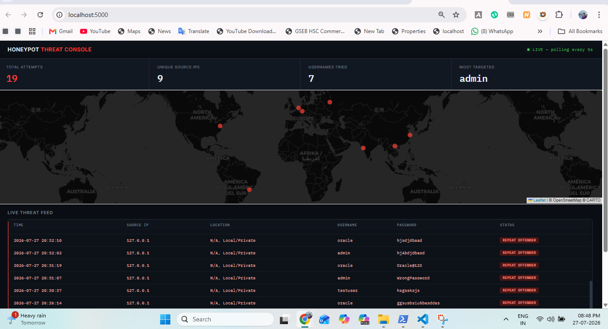

# SSH Honeypot with Live Attack Map Dashboard

A fake SSH server that lures and logs real login attempts, then visualizes them on a live, dark-themed threat console — geolocating each attacker and streaming the data to a world map and a scrolling live feed, similar in spirit to commercial cyber-attack visualization tools.

## Features

- Fake SSH server (built with Paramiko) that accepts connections and captures every username/password an attacker tries, then always rejects the login — no real access is ever granted
- Every attempt is logged to a local SQLite database with timestamp, source IP, username, and password
- GeoIP lookup resolves each attacker's IP to a country, city, and coordinates
- A Flask backend serves the captured data as a JSON API
- A live "Threat Console" dashboard (dark theme, monospace data styling) shows:
  - Real-time stat cards: total attempts, unique source IPs, usernames tried, most-targeted username
  - A dark world map plotting each attacker's approximate location
  - A scrollable live feed table that flags repeat offenders (same IP attempting multiple times) in red
- Dashboard auto-refreshes every 5 seconds by polling the backend, no page reload needed

## Architecture

```
Attacker / Test Client
      |
      v
Fake SSH Server (honeypot.py, Paramiko)
   - Accepts connection, presents fake SSH banner
   - Captures username + password on auth attempt
   - Always returns AUTH_FAILED (no real access granted)
      |
      v
GeoIP Lookup (geoip.py) --> resolves source IP to country/city/coordinates
      |
      v
SQLite Database (db.py) --> stores every captured attempt
      |
      v
Flask Backend (app.py) --> serves attempts as JSON via /api/attempts
      |
      v
Threat Console Dashboard (dashboard.html)
   - Polls the API every 5 seconds
   - Renders stat cards, a dark world map, and a live scrolling feed
```

## Tech Stack

- Python 3, Paramiko (fake SSH server)
- SQLite (attempt storage)
- Flask (backend API)
- ip-api.com (free GeoIP lookup)
- Leaflet.js + CARTO dark tiles (map visualization)
- IBM Plex Mono + Inter (dashboard typography)

## How to Run

### Setup

```bash
python3 -m venv venv
source venv/bin/activate
pip install -r requirements.txt
ssh-keygen -t rsa -b 2048 -f src/honeypot_key -N ""
```

### Run the honeypot (captures real SSH attempts)

```bash
python src/honeypot.py
```

### Run the dashboard (in a separate terminal)

```bash
python src/app.py
```

Then open `http://localhost:5000` in a browser.

### Trigger a test attempt (in a third terminal)

```bash
ssh -p 2222 testuser@localhost
```

Enter any password — the connection will be captured and rejected, then appear on the dashboard within 5 seconds.

## Demo

The dashboard shown below combines two data sources: sample attack data seeded from realistic global IP ranges (to demonstrate the geolocation and map pipeline working end-to-end), and real captured attempts from local test connections (shown as repeat offenders from 127.0.0.1, since repeated manual testing naturally comes from the same source).



## Notes on Sample Data vs Real Captures

WSL2's loopback interface means locally-run test attempts always originate from 127.0.0.1, which cannot be meaningfully geolocated (private/loopback IPs are excluded from GeoIP resolution by design in this project, matching how real GeoIP services behave). To demonstrate the full geolocation and mapping pipeline, the database was seeded with realistic sample attack records at real-world IP ranges and coordinates, clearly separate from the live capture logic itself. The honeypot's capture, database, and API code are all fully functional against genuine SSH connections — deploying this on a publicly exposed server (e.g. a cloud VM) would immediately begin capturing real internet-scanning bots with real, diverse geolocations, with zero code changes required.

## Limitations and Future Work

- Currently tested only via local connections and seeded sample data; not yet deployed with public internet exposure
- No rate limiting or IP banning — a real deployment might feed captured IPs into a firewall blocklist (see my Python Stateful Firewall project for a compatible blocking mechanism)
- SQLite is fine for a single-instance demo but would need a proper database for high-volume production use
- GeoIP lookups are synchronous per attempt; a production version should cache or batch these to avoid rate limits from the free API tier

## What I Learned

Building a functioning fake SSH server surfaced real protocol-level details that don't show up in higher-level tools: the SSH transport handshake, why authentication callbacks need to be handled asynchronously with proper event signaling (a flat timer isn't reliable, since a real client may take variable time to respond), and how easily unrelated background noise (browser port probes, IDE port auto-detection) can look like application bugs during debugging. On the visualization side, this project reinforced how threat intelligence dashboards are built in practice: capture, enrich (geolocate), store, and expose data through an API for a lightweight polling frontend, rather than tightly coupling the capture logic to the display layer.